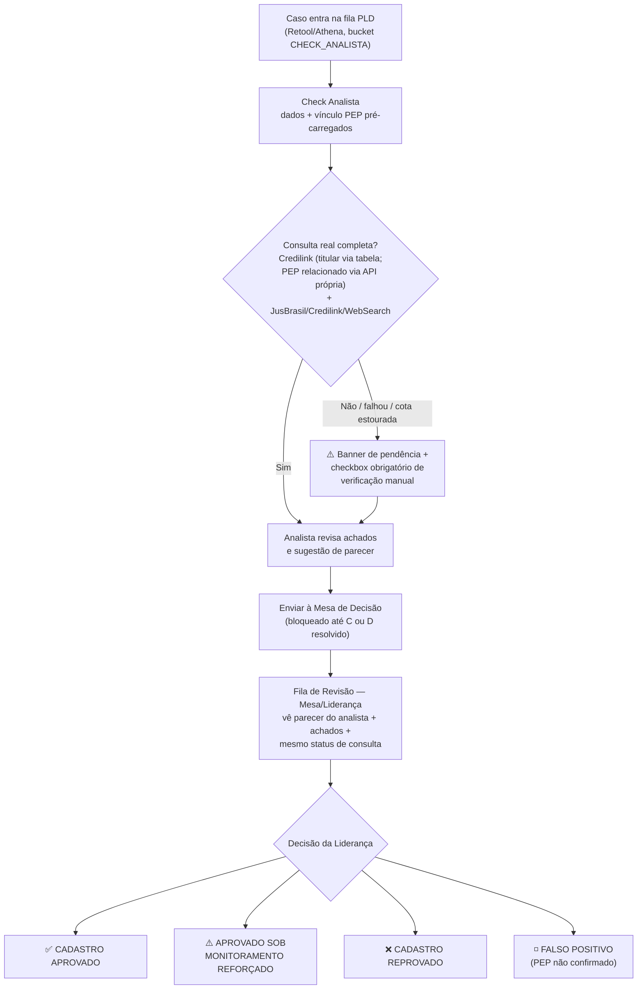

# Pepito — Apoio à Análise PLD/KYC de PEPs

**Pepito** é uma ferramenta interna construída para dar celeridade ao time de PLD/FT da Cora na
análise de cadastros com suspeita de Pessoa Politicamente Exposta (PEP), seguindo o fluxo de duas
camadas exigido pela Circular BCB nº 4.001/2020.

> ⚠️ **Pepito não é uma ferramenta implementada em produção pela Cora.** É um apoio interno do time
> de PLD/FT — a decisão final e a responsabilidade regulatória permanecem com os analistas e a
> Liderança de Compliance.
>
> **Acesso:** `https://192-168-201-67.sslip.io:4173` (VPN Cora) — único servidor, não subir instância paralela.

---

## O que o Pepito faz

Para cada cadastro suspeito de PEP na fila (vindo do Retool/Athena), o Pepito:

1. Pré-carrega os dados do cadastro e do vínculo PEP (Credilink).
2. Roda (ou expõe o status de) verificações reais — Credilink, JusBrasil, Credilink, mídia — para
   o titular da conta **e** para o PEP relacionado, quando aplicável.
3. Sugere um parecer (analista e, depois, Liderança), sempre editável.
4. **Bloqueia o envio à Mesa de Decisão se essas verificações não estiverem completas**, a menos que
   o analista confirme manualmente que verificou por fora.
5. Dá à Liderança os mesmos achados + o parecer do analista, para a decisão final em uma de 4
   categorias regulamentares.

Nada disso substitui o julgamento do analista/Liderança — é apoio à decisão, não decisão automática.

---

## Fluxo do processo



**Onde cada verificação acontece:**

| Verificação | Fonte | Quando roda | Owner do dado |
|---|---|---|---|
| Identificação do PEP | Credilink (via notebook do onboarding, fora deste repo) | Antes do caso chegar ao Pepito | `pep_pf` / `token_pf_cred` |
| Antecedentes do titular da conta | JusBrasil + Credilink | `fetch-media-findings.py`, disparado por `queue-sync.sh` | `media-findings.json` |
| Antecedentes do PEP relacionado | JusBrasil + Credilink (mesmo script, mesmo CPF do PEP) | idem | `media-findings.json` |
| Consulta Credilink do PEP relacionado (nunca existia antes de 2026-09-11) | `consultar-credilink-pep.py` | Manual/agendado, separado do fluxo de onboarding | `credilink-pep-consultas.json` |
| Mídia adversa (WebSearch) | Anthropic web_search | idem `fetch-media-findings.py` | `media-findings.json` |

---

## As duas camadas

### 1. CHECK_ANALISTA — `/check-analista`

- Fila com `bucket = CHECK_ANALISTA` do snapshot Retool/Athena.
- Card de cada caso mostra logo no topo o status de consulta Credilink e JusBrasil/Credilink
  (✅ OK / ⚠️ pendente, com o motivo).
- Analista abre o caso (`/primeira-camada`), revisa achados reais e a sugestão de parecer
  (LLM ou heurística), edita, e envia à Mesa.
- **Guardrail:** se Credilink (do PEP relacionado) ou JusBrasil/Credilink não tiverem consulta real
  registrada, o botão "Enviar à Mesa" fica bloqueado até o analista marcar o checkbox de
  "verifiquei manualmente" — essa confirmação fica registrada no histórico do caso (quem, quando,
  o que estava pendente).
- Pesquisa/Repesquisa manual (`pesquisarFontesPublicas`, simulação determinística) é desabilitada
  para casos reais, para nunca sobrescrever achado real com dado fictício — só existe no fluxo
  100% manual (Novo Caso Manual), sempre com aviso explícito de que é simulação.

### 2. CHECK_LIDERANÇA — `/fila-revisao` (Mesa de Decisão)

- Mesmo card de status Credilink/JusBrasil, mesmo parecer do analista, mesmos achados —
  a Liderança nunca reconsulta o que o Analista já verificou (mesmo draft_id).
- Decisão final em uma das 4 categorias: **APROVADO**, **REPROVADO**, **APROVADO SOB
  MONITORAMENTO REFORÇADO**, **FALSO POSITIVO**.
- Template de parecer final confere os achados reais antes de afirmar "ausência total de
  sanções/processos/mídia" — nunca afirma isso incondicionalmente só pela categoria escolhida.

### 3. Dashboard — `/dashboard`

KPIs operacionais (total, concluídas, tempo médio por camada, distribuição por status,
análises por analista) e exportação CSV. Não participa da decisão regulatória.

---

## Guardrails (o que impede um caso mal-verificado de avançar)

| Guardrail | Onde | Efeito |
|---|---|---|
| Filtros de elegibilidade da fila | `passesPLDFilters()` (`registration-queue.ts`) | Só entram casos com status/sub_status/person_type corretos |
| **Consulta real antes da Mesa** | `getConsultaStatus()` (`registration-enrich.ts`) + banner/checkbox em `AnalisePrimeiraCamada.tsx` | Bloqueia "Enviar à Mesa" sem consulta real ou confirmação manual explícita e auditável |
| Token Credilink rotulado corretamente | `AnalisePrimeiraCamada.tsx`, `NovaAnalise.tsx` | Nunca mostra o token do titular como se fosse do PEP relacionado |
| Simulação nunca sobrescreve dado real | `AnalisePrimeiraCamada.tsx`, `NovaAnalise.tsx` | "Pesquisar"/"Repesquisar" desabilitados para casos com `draft_id` real |
| Achado não-verificado nunca vira "confirmado" | `toResultado()` (`registration-enrich.ts`) | Deep-link nunca aberto = `pendente_verificacao: true`, sem badge de similaridade |
| Falha de API ≠ resultado negativo | `fetch-media-findings.py` (`_finding_erro_consulta`) | Erro técnico vira achado explícito "verificação manual necessária", nunca "nada encontrado" |
| Parecer final confere achados reais | `parecer.ts` (`corpoTemplate`) | Não afirma "ausência total" se há achado real não descartado |
| Match anti-homônimo | `passesPLDFilters` + telas de resultado | Só CNPJ/CPF idêntico conta como match; fuzzy por nome não reprova ninguém |
| Sugestão IA nunca diverge do parecer do analista | `getSugestaoParecer`/`getSugestaoLideranca` | Mesa sempre lê o comentário real do analista, nunca só o status sugerido |
| Persistência com fallback | `storage.ts` | `localStorage` + backup em `analises-salvas.json`; reload não perde dado |

**Limitação conhecida (não é bug, é contrato):** o JusBrasil Background Check só cobre processos
criminais, BNMP e MP — não tem endpoint cível/trabalhista. Para isso, o Credilink
(`ProcessoTribunalJustica`) complementa com achados não-criminais.

Detalhes de incidentes específicos (causa raiz, quando, como foi corrigido): ver
`.tools/INCIDENT-REPORT-*.md`.

---

## Stack

| Camada | Tecnologia |
|---|---|
| Frontend | React 18 + TypeScript + Vite |
| Servidor | Express (Node.js) — `server.cjs` |
| Autenticação | Google SSO (`@cora.com.br`) |
| Persistência | `localStorage` + `src/data/*.json` (backup em disco, sem banco externo) |
| Fonte de dados | Snapshot JSON da fila PLD (Retool/Athena) + consultas próprias (JusBrasil/Credilink) |

---

## Rodando localmente

```bash
# Dev (sem SSO, sem HTTPS)
npm install && npm run dev        # http://localhost:5173

# Produção local (SSO + HTTPS via certs/)
./start-local.sh
```

O binário portável do Node está em `.tools/node/bin/` — não precisa instalar Node no sistema
(`export PATH=".tools/node/bin:$PATH"`).

---

## Estrutura de arquivos relevantes

```
src/
  pages/
    CheckAnalista.tsx          — Fila CHECK_ANALISTA (1ª camada)
    AnalisePrimeiraCamada.tsx  — Formulário de análise, guardrail de consulta, cronômetro
    FilaRevisao.tsx            — Fila de revisão para Liderança
    NovaAnalise.tsx            — Mesa de Decisão (2ª camada)
    Dashboard.tsx              — Métricas e histórico
  components/
    RegistrationCaseCard.tsx   — Card da fila (Analista + Liderança) — status Credilink/JusBrasil no topo
  lib/
    registration-queue.ts      — Lógica de filas, buckets, synthesizeAnalise
    mock-ai.ts                 — SIMULAÇÃO determinística — só no fluxo 100% manual
  data/
    registration-enrich.ts     — getConsultaStatus(), enriquecimento de achados, pareceres
    registration-queue-real.json, media-findings.json, credilink-pep-consultas.json — dados

.tools/
  build-real-queue.py              — Puxa fila real do Athena
  fetch-media-findings.py          — JusBrasil + Credilink + WebSearch (owner + PEP relacionado)
  consultar-credilink-pep.py       — Consulta Credilink real do PEP relacionado (novo, 2026-09-11)
  generate-sugestao-parecer.py     — Sugestão IA (Analista)
  generate-sugestao-lideranca.py   — Sugestão IA (Liderança)
  generate-pld-risk-scores.py      — Score de risco
  queue-sync.sh                    — Pipeline disparado pelo botão "Sincronizar Athena"
  supervisor-agent.py              — Monitoramento automático (ver seção abaixo)
  integrity-guard.py                — Backup/auto-restore de pareceres
  INCIDENT-REPORT-*.md              — Histórico de incidentes com causa raiz e fix
```

---

## Monitoramento e proteção de dados

Dois agentes rodam automaticamente 2x/dia (6h e 14h), orquestrados por `full-guard-schedule.sh`:

- **Supervisor Agent** (`.tools/supervisor-agent.py`) — verifica servidor, fila, build, cobertura de
  sugestão IA, integridade dos JSONs e TypeScript. Alerta no Slack (`SLACK_WEBHOOK_URL_PEPITO_SUPERVISOR`)
  por nível de risco (🔴🟠🟡🔵).
- **Integrity Guard** (`.tools/integrity-guard.py`) — faz backup dos pareceres antes de cada janela,
  detecta exclusão/encolhimento e restaura automaticamente. Histórico em `.tools/backups/pareceres/`.

```bash
# Rodar manualmente
python3 .tools/supervisor-agent.py
python3 .tools/integrity-guard.py

# Ver logs
tail -f .tools/supervisor.log .tools/integrity.log
```

---

## Troubleshooting rápido

| Sintoma | Causa provável | Ação |
|---|---|---|
| Sugestão IA ausente para caso novo | `pareceres-*.json` regenerado mas app não rebuildado (import estático em build-time) | `npm run build` + reiniciar `com.cora.pepito.server` |
| "Credilink/JusBrasil: pendente" mesmo após rodar consulta | Servidor rodando bundle antigo | rebuild + `launchctl kickstart -k gui/$(id -u)/com.cora.pepito.server` |
| Draft some da fila | `camadaStatus` local desatualizado | ver `analises-salvas.json`, checar `devolvido`/`concluido` |
| Nenhum alerta no Slack | Webhook errado/ausente | `grep SLACK_WEBHOOK_URL_PEPITO_SUPERVISOR .env` |

---

**Última atualização:** 2026-09-11
